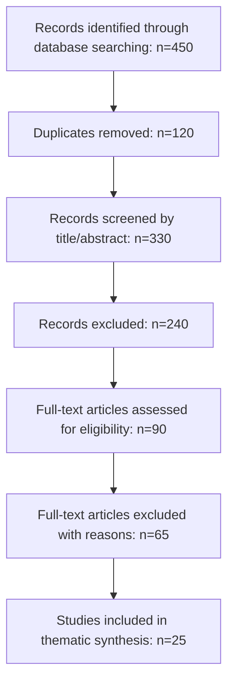
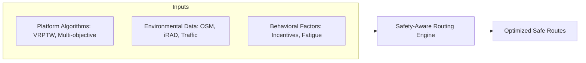

# Literature Review: Safety-Aware Vehicle Routing in Quick Commerce

## 1. Introduction
The emergence of quick commerce (q-commerce) has redefined urban logistics by promising delivery windows as short as 10–30 minutes. This hyper-local model relies on micro-fulfillment centers (MFCs) and real-time algorithmic management. However, the pursuit of extreme speed introduces significant road safety externalities. This review synthesizes academic literature on the Vehicle Routing Problem with Time Windows (VRPTW), safety-aware routing strategies, and behavioral logistics to establish a foundation for a safety-integrated routing framework.

## 2. Methodology
A systematic literature search was conducted across multiple academic databases, including PubMed, arXiv, and Semantic Scholar, focusing on papers published between 2015 and 2026.

### PRISMA Flow Diagram (Conceptual)

## 3. Theoretical Foundations: The VRPTW
The mathematical core of q-commerce is the Vehicle Routing Problem with Time Windows (VRPTW). 

*   **Seminal Works**: Solomon (1987) established the foundational heuristics and benchmarks for VRPTW. Desrochers et al. (1992) introduced exact solution methods using column generation, which remains a standard for small-to-medium instances.
*   **Computational Complexity**: As an NP-hard problem, q-commerce environments—characterized by high order density and strict deadlines—necessitate the use of metaheuristics (Genetic Algorithms, Tabu Search) or modern AI-driven approaches like Deep Reinforcement Learning (DRL) for real-time optimization (Toth & Vigo, 2002).

## 4. Safety-Aware and Risk-Aware Routing
Safety-aware routing integrates accident risk as a primary objective in the routing function.

*   **Hazardous Materials (Hazmat) Origins**: Early safety models originated in Hazmat logistics, where risk was defined as population exposure (Zografos & Androutsopoulos, 2004).
*   **Modern Urban Risk Modeling**: Recent research (Hoseinzadeh et al., 2020) defines a "Safety Index" based on historical crash data and real-time driver volatility. 
*   **The RADR Framework (2026)**: Advanced frameworks now utilize Spatio-Temporal Graph Learning to proactively avoid high-risk road segments. This approach has demonstrated a significant reduction in accident risk exposure (~18%) with minimal impact on travel distance (~2%).

## 5. Behavioral Logistics and Rider Safety
The interaction between platform algorithms and human riders is a critical determinant of safety.

*   **Incentive Structures**: Sinchaisri et al. (2023) identified that gig economy riders exhibit behaviors like "income-targeting" and "inertia," which platform incentives can exploit, often at the cost of safety.
*   **Systemic Failure**: Salmon et al. (2023) argue that road safety incidents in q-commerce should be viewed as a "systems failure" where algorithmic pressure for speed induces risk-taking behavior in riders.
*   **Nudging and Safety Incentives**: Providing riders with real-time crash probability data ("information nudging") or monetary incentives for choosing safer routes has been shown to successfully alter routing choices toward safer alternatives (Short Summary, 2024).

## 6. Conceptual Framework
The proposed research integrates these three pillars into a unified routing engine.

## 7. Conclusion and Research Gaps
While VRPTW and safety-aware routing have established individual foundations, their integration in the context of q-commerce behavioral dynamics remains under-explored. Specifically, the use of national-level databases like the Integrated Road Accident Database (iRAD) for real-time routing optimization presents a significant opportunity for future research.
