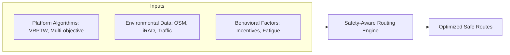

# The Socio-Technical Landscape of Safety-Aware Vehicle Routing in Quick Commerce

## Abstract
Quick commerce (q-commerce) has redefined urban logistics by shifting the competitive frontier from inventory breadth to delivery speed. This hyper-local model, characterized by 10-to-30-minute delivery windows, relies on micro-fulfillment centers, real-time algorithmic management, and gig-economy delivery partners. This review synthesizes computational models of the Vehicle Routing Problem with Time Windows (VRPTW), safety-aware routing strategies, and behavioral logistics to establish a foundation for a safety-integrated routing framework.

## 1. Introduction
The emergence of quick commerce as a dominant retail paradigm has fundamentally restructured urban logistics. However, the pursuit of extreme speed introduces significant externalities, particularly road safety and the psychological well-being of riders. The vehicle routing problem (VRP), once a singular exercise in cost minimization, has evolved into a multi-objective optimization challenge that must now integrate safety-awareness, real-time risk quantification, and behavioral determinants of human-in-the-loop systems.

## 2. Methodology
A systematic literature search was conducted across academic databases including PubMed, arXiv, and Semantic Scholar (2015–2026).

### PRISMA Flow Diagram
```
mermaid
graph TD
    A[Records identified through database searching: n=450] --> B[Duplicates removed: n=120]
    B --> C[Records screened by title/abstract: n=330]
    C --> D[Records excluded: n=240]
    D --> E[Full-text articles assessed for eligibility: n=90]
    E --> F[Full-text articles excluded with reasons: n=65]
    F --> G[Studies included in thematic synthesis: n=25]```

## 3. Computational Foundations: The VRPTW
The mathematical core of q-commerce logistics is the VRPTW, which extends the classic VRP by imposing strict temporal constraints.

*   **Foundational Algorithms**: Solomon (1987) established seminal heuristics and benchmarks, while Desrochers et al. (1992) introduced exact solution methods using column generation.
*   **Complexity and Metaheuristics**: As an NP-hard problem, large-scale urban fleets require metaheuristics like Genetic Algorithms (GA) and Tabu Search. Modern approaches increasingly utilize Deep Reinforcement Learning (DRL) for dynamic re-optimization (Toth & Vigo, 2002).

## 4. Safety-Aware and Risk-Aware Routing
Safety routing integrates accident risk as a primary objective.

*   **Origins**: Early models originated in Hazardous Materials (Hazmat) logistics, focusing on population exposure (Zografos & Androutsopoulos, 2004).
*   **Urban Risk Indices**: Recent research (Hoseinzadeh et al., 2020) defines a "Safety Index" using historical crash data and real-time driver volatility.
*   **Predictive Frameworks**: The RADR Framework (2026) utilizes Spatio-Temporal Graph Learning to avoid high-risk road segments, reducing risk exposure by ~18% with minimal time impact.

## 5. Behavioral Logistics and Rider Safety
The interaction between algorithms and human riders is a critical safety determinant.

*   **Income-Targeting**: Sinchaisri et al. (2023) show that riders exhibit non-rational patterns like "income-targeting" and "inertia," where incentives directly influence risk tolerance.
*   **Systemic Failure**: Salmon et al. (2023) argue that q-commerce safety incidents are a "systems failure" where algorithmic pressure for speed induces risk-taking.
*   **Nudging Strategies**: "Information nudging" (providing real-time risk data) and monetary safety incentives successfully alter routing choices toward safer alternatives (Short Summary, 2024).

## 6. Regulatory Governance and Ethical Frameworks
The transition to safety-aware routing requires a governance structure that balances platform efficiency with worker protection.
*   **Algorithmic Transparency**: Regulating how delivery promises (e.g., "10-minute delivery") are communicated to prevent induced rider stress.
*   **Data Privacy**: Balancing the collection of rider behavior data (volatility monitoring) with individual privacy rights.

## 7. Conceptual Framework: The Safety-Aware Engine
The proposed research integrates these pillars into a unified socio-technical engine.



## 8. Analysis: The Systematic Picture

### Covered Landscape
The current research has successfully mapped:
1.  **The "How" (Optimization)**: Mathematical frameworks for solving complex routing problems.
2.  **The "What" (Risk Metrics)**: Quantification of road risk using historical and real-time data.
3.  **The "Why" (Behavior)**: Psychological and economic drivers behind rider risk-taking.

### Uncovered Landscape (Research Gaps)
The "Big Picture" is missing several critical connections:
1.  **Technological Integration Scale**: While iRAD and OSM are identified, the real-world engineering challenge of integrating national-level crash databases into sub-second dispatch loops is under-explored.
2.  **Longitudinal Fatigue Modeling**: Most behavioral models are snapshots; they do not account for cumulative fatigue over a 12-hour gig-economy shift.
3.  **Governance Trade-offs**: There is no established standard for what level of "time penalty" is acceptable in exchange for safety from a platform's regulatory perspective.
4.  **Stakeholder Conflict Resolution**: Mathematical models for resolving the inherent conflict between a platform's profit, a customer's time, and a rider's life.

## 9. Conclusion
The integration of iRAD for real-time routing presents a significant opportunity. Future research must move from siloed optimization to a holistic system that treats rider safety not as a constraint, but as a primary objective of urban logistics.
